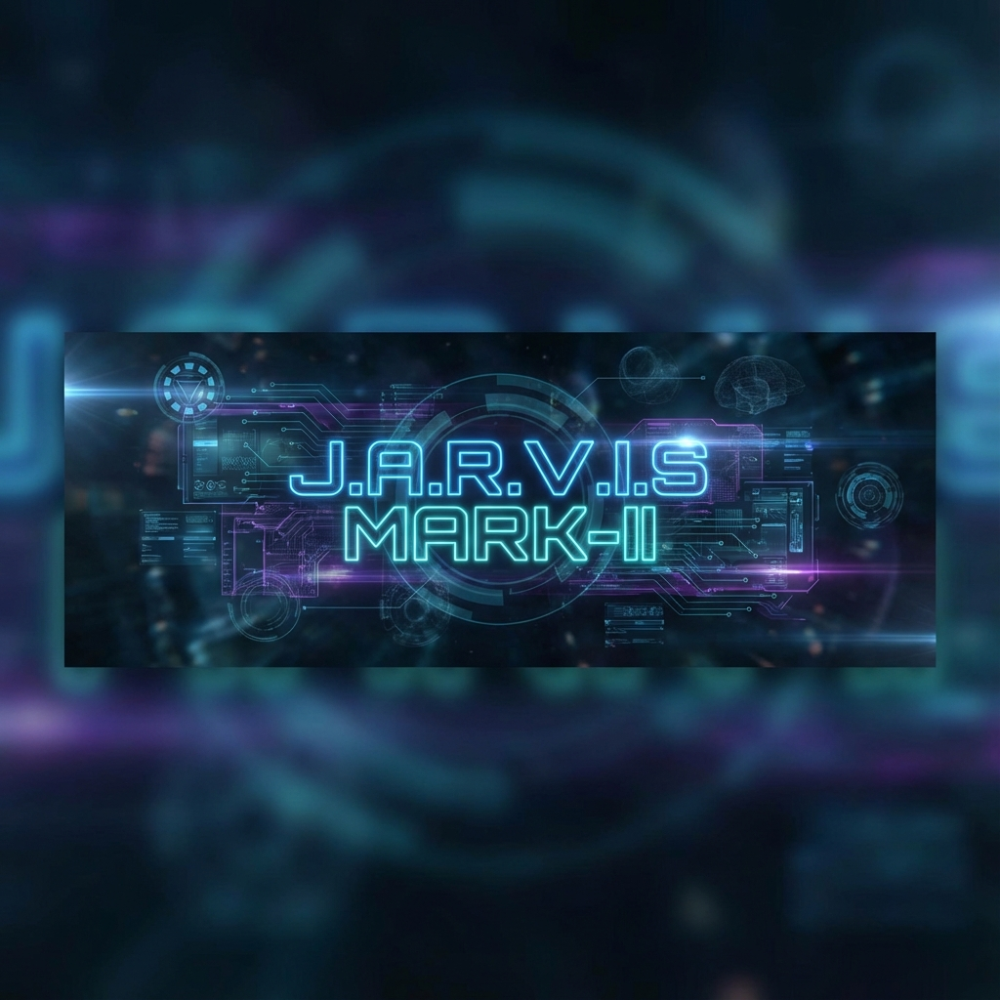

# JARVIS Mark-II Premium Edition



[](https://opensource.org/licenses/MIT)
[](https://www.python.org/downloads/)
[]()
[]()

> *"I am Iron Man."*

**JARVIS Mark-II** is a state-of-the-art Personal AI Assistant designed to bring the cinematic experience of Tony Stark's AI to your desktop. It combines **Holographic UI**, **Biometric Security**, **Computer Vision**, and **Voice Automation** into a single, modular Python application.

---

## 🚀 Features

### 🎤 Voice Command Center
- **Wake Word**: "Jarvis" (Passive listening with auto-recovery).
- **One-Shot Commands**: "Jarvis open Google" executes instantly.
- **Deep Tone**: Tuned for a calm, authoritative AI presence.
- **Commands**: Shutdown, Screenshot, Media Control, Search, and more.

### 🧠 Biometric Security 2.6
- **Face ID**: Geometric feature recognition with Cosine Similarity.
- **Security Lock**: Locks voice commands if an unknown user is detected.
- **Admin Mode**: Exclusive access to critical system functions.

### 🖥️ Cinematic Hologram UI
- **Glassmorphism**: Glowing, transparent panels with Stark Tech aesthetics.
- **Visuals**: Matrix Rain, FPS Counter, GPU Status, and Voice Activity indicators.
- **Animations**: Smooth fade-ins, cursor halos, and motion trails.

### 🖱️ Gesture Control
- **Hand Mouse**: Control your cursor with your index finger.
- **Air Click**: Pinch to click.
- **Safety**: Make a fist to pause. Press `ESC` to toggle.

### 👁️ Vision System
- **YOLOv8**: Real-time object detection (80+ classes).
- **GPU Acceleration**: Auto-detects NVIDIA CUDA for maximum performance.

---

## 🛠️ Tech Stack

- **Core**: Python 3.10+
- **Vision**: OpenCV, MediaPipe, Ultralytics YOLOv8
- **Voice**: PyTTSx3, SpeechRecognition, PyAudio
- **System**: PyAutoGUI, PSUtil, Keyboard
- **Math**: NumPy, SciPy

---

## 💻 System Requirements

| Component | Minimum | Recommended |
|-----------|---------|-------------|
| **OS** | Windows 10/11 | Windows 11 |
| **CPU** | Intel i5 / Ryzen 5 | Intel i7 / Ryzen 7 |
| **RAM** | 8 GB | 16 GB+ |
| **GPU** | Integrated | NVIDIA RTX 3060+ (for YOLO) |
| **Mic** | Built-in | High-quality USB Mic |
| **Cam** | 720p Webcam | 1080p 60fps Webcam |

---

## ⚡ Installation

1. **Clone the Repository**:
   ```bash
   git clone https://github.com/tusharcancodehere/JARVIS-MarkII.git
   cd JARVIS-MarkII
   ```

2. **Install Dependencies**:
   ```bash
   pip install -r requirements.txt
   ```

3. **Run JARVIS**:
   ```bash
   python run_jarvis.py
   ```

---

## 🗣️ Voice Commands

| Category | Command | Action |
|----------|---------|--------|
| **System** | "Shutdown system" | Initiates PC shutdown sequence |
| **System** | "Take screenshot" | Saves screen capture to `data/screenshots` |
| **System** | "Mute/Unmute mic" | Toggles voice listening |
| **Window** | "Maximize/Minimize window" | Controls active window |
| **Info** | "Battery status" | Reports power level |
| **Info** | "Time" / "Date" | Reports current time/date |
| **Vision** | "Enable/Disable object detection" | Toggles YOLO AI |
| **Mouse** | "Enable/Disable mouse" | Toggles Hand Gestures |
| **Web** | "Search Wikipedia [Query]" | Opens Wikipedia article |
| **Web** | "Open YouTube/Google" | Launches websites |
| **Identity** | "Register my name is [Name]" | Enrolls new user face |

---

## 🔧 Troubleshooting

- **Microphone**: Ensure your default input device is set correctly in Windows Sound Settings.
- **Camera**: If the app crashes on start, check if another app is using the webcam.
- **Lag**: Disable Object Detection ("Jarvis disable object detection") to free up resources.

---

## 📜 License

Distributed under the MIT License. See `LICENSE` for more information.

---

*Built with ❤️ by [Tushar]*
